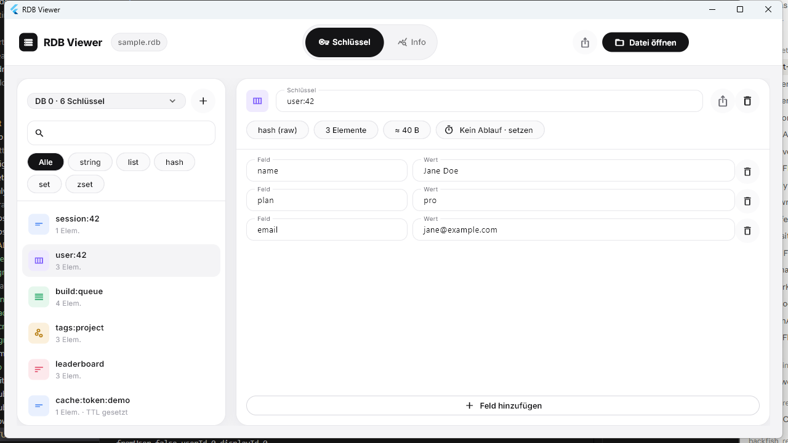
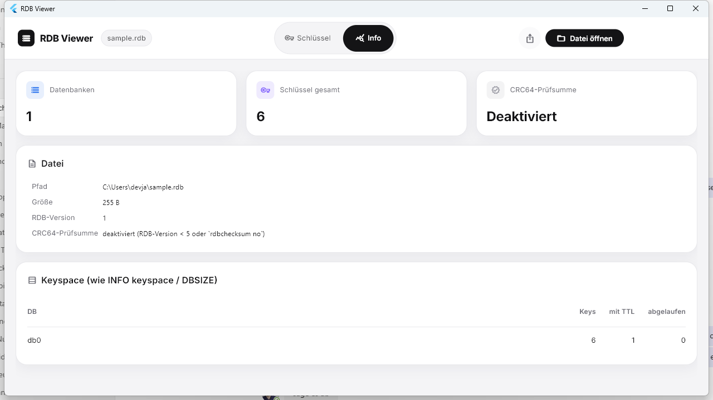

<div align="center">

# RDB Viewer

**A free, open-source desktop app to view and edit Redis `.rdb` backup files — no running Redis server required.**

[](https://github.com/changelogseu/rdb-viewer/actions/workflows/ci.yml)
[](LICENSE)
[](#installation)

</div>

<p align="center">
  
  
</p>

Redis's `.rdb` dump/backup format is binary and not human-readable. Until now,
inspecting one meant spinning up a Redis instance, loading the file, and
poking around with `redis-cli` — or reaching for a Python script. RDB Viewer
opens the file directly: browse every key, see its type and TTL, edit values
in place, and export what you need — all as a small native desktop app, with
no server, no telemetry, and no network access at all.

> **UI language:** the app's interface is currently German-only (this repo's
> primary audience so far). Contributions to add English/i18n are very
> welcome — see [Contributing](#contributing).

## Features

- **Open `.rdb` files directly** (RDB versions 1–11), with CRC64 checksum
  verification.
- **String, List, Hash, Set, and Sorted Set** support, across all common
  on-disk encodings (raw, `ziplist`, `listpack`, `intset`,
  `quicklist`/`quicklist2`, LZF-compressed strings).
- **Multiple databases**, TTL/expiry display and editing, `AUX` metadata
  (`redis-ver`, `os`, `ctime`, ...).
- **Edit in place**: rename keys, edit/add/remove values and TTLs, add or
  delete keys entirely.
- **Export**: the whole file or a single key as JSON (binary-safe via
  base64) or as ready-to-run Redis commands
  (`SET`/`HSET`/`SADD`/`ZADD`/`RPUSH`/`PEXPIREAT`) for `redis-cli`.
- **Info tab**: file-level diagnostics — the `.rdb`-file equivalent of
  `DBSIZE`/`INFO keyspace`, plus a clear report of any key this parser
  couldn't decode (see [Limitations](#limitations)) instead of silently
  dropping data.
- **`file.rdb` as a launch argument** for "Open with" integration on
  Windows/macOS.
- 100% local: no server, no account, no analytics, no network calls.

## Installation

### Download a release (recommended)

Grab the latest build for your platform from the
[Releases page](https://github.com/changelogseu/rdb-viewer/releases),
unzip it, and run it.

> **macOS:** builds aren't code-signed or notarized (that requires a paid
> Apple Developer account). If Gatekeeper blocks the app, either allow it
> via *System Settings → Privacy & Security → "Open Anyway"*, or run
> `xattr -dr com.apple.quarantine "RDB Viewer.app"` in Terminal after
> unzipping.

### Build from source

Requires the [Flutter SDK](https://docs.flutter.dev/get-started/install)
(stable channel) with the Windows and/or macOS desktop toolchain enabled
(`flutter doctor` will tell you what's missing).

```bash
git clone https://github.com/changelogseu/rdb-viewer.git
cd rdb-viewer
flutter pub get
flutter run -d windows   # or: flutter run -d macos
```

## Architecture

```
lib/
  rdb/                       Pure Dart library, no Flutter import - the RDB parser
    byte_reader.dart           Low-level read cursor over the file buffer
    length_and_string.dart     RDB length/string encoding (incl. LZF, integers)
    lzf.dart                   LZF decompression
    intset.dart                 intset decoder
    listpack.dart                listpack decoder (Redis 7+ default encoding)
    ziplist.dart                  ziplist decoder (legacy encoding, pre-Redis 7)
    crc64.dart                    CRC-64/Jones for the file checksum
    rdb_type_bytes.dart            RDB opcode/type constants
    rdb_model.dart                  Data model (RdbDocument/-Database/-Entry/-Value)
    rdb_parser.dart                  The actual parser (parseRdbFile)
  export/                     JSON and Redis-command export
  app_state.dart              Provider/ChangeNotifier: loaded document + UI state
  ui/                         Flutter widgets (key list, value editors, dialogs, theme)
```

`lib/rdb/` is deliberately free of Flutter dependencies and directly
testable with `package:test` (see `test/rdb/`) - it could be reused as a
standalone RDB-parsing library outside this app.

## Limitations

- **No direct write-back into a `.rdb` file (yet).** That would need a full
  RDB writer (LZF compression, encoding choices, CRC64) and carries a real
  risk of corrupting the original file. Edits are exported as JSON
  (lossless) or as Redis commands instead. A write-back mode is a plausible
  future addition once the read path has seen more real-world use - see
  [Contributing](#contributing) if you'd like to help with that.
- **Streams, Redis module types (e.g. RedisJSON), legacy zipmap-encoded
  hashes, and the Redis 7.4+ hash-field-TTL encodings are not decoded.**
  RDB has no generic mechanism to skip an unknown value type (neither does
  Redis itself) - when the parser hits one of these, it stops reading that
  database and clearly reports which key/type/offset it stopped at in the
  **Info** tab, rather than guessing or silently dropping data.
- Binary values (not valid UTF-8) are shown but not editable as text yet;
  the JSON export preserves them losslessly via base64.
- No drag & drop to open a file yet (use the file dialog, or pass the path
  as a launch argument).

If you hit one of these with a real file, please open an issue - see
[Contributing](#contributing).

## Contributing

Contributions are welcome! See [CONTRIBUTING.md](CONTRIBUTING.md) for the
dev setup, project layout, and what to include when reporting a file that
won't open. Please also read the
[Code of Conduct](CODE_OF_CONDUCT.md).

```bash
flutter analyze
flutter test
```

Since no `redis-server` was available while building the parser's test
suite, the RDB decoders are tested against hand-built byte fixtures matched
against the format spec (`test/rdb/`). If you run this against real
`.rdb` files from your own Redis instances and hit a parsing issue, that
feedback (and, ideally, a minimal reproducing file) is especially valuable.

## License

[GPL-3.0-or-later](LICENSE) - free to use, modify, and redistribute. If you
distribute a modified version (including as a compiled app), you must also
make its source available under the same license - this keeps RDB Viewer
and any derivatives free and open, and prevents a closed-source or
commercial fork. See [THIRD_PARTY_NOTICES.md](THIRD_PARTY_NOTICES.md) for
the licenses of the bundled Inter font and other third-party components
(all permissive and GPL-compatible).
